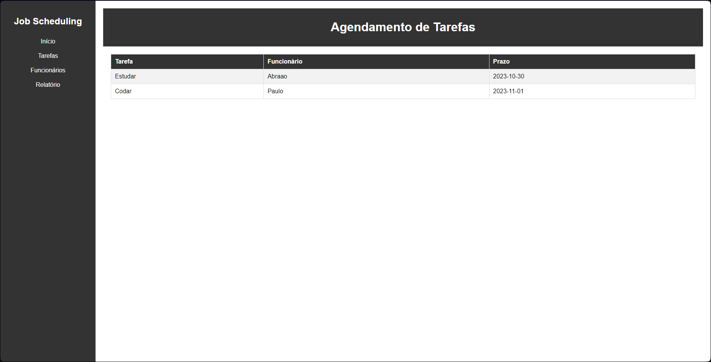
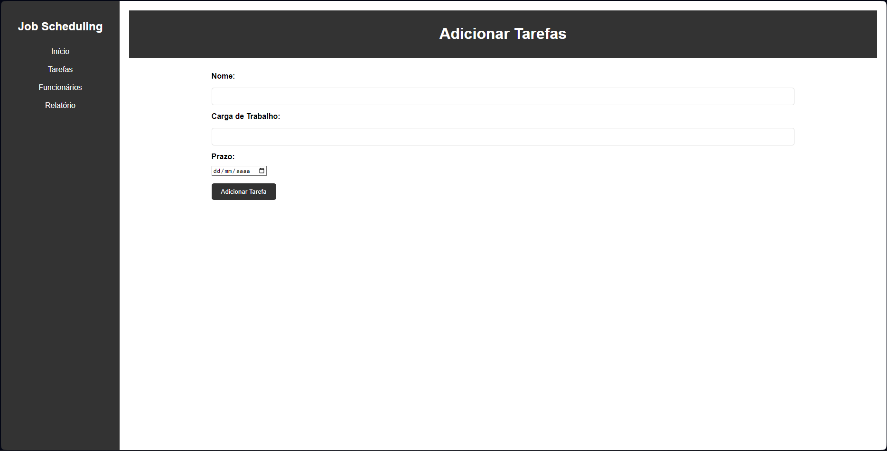
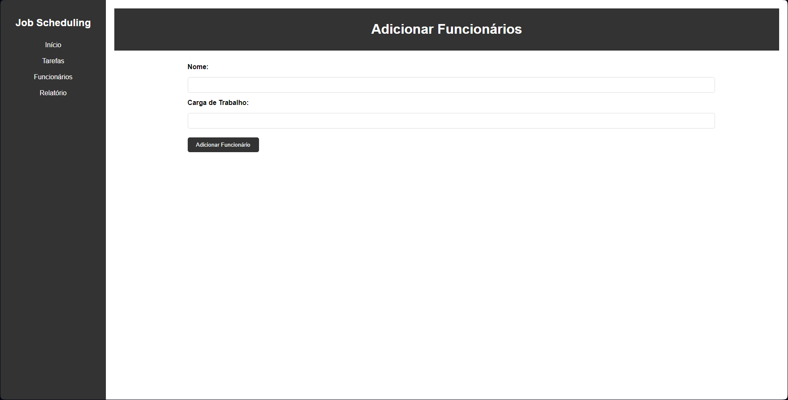
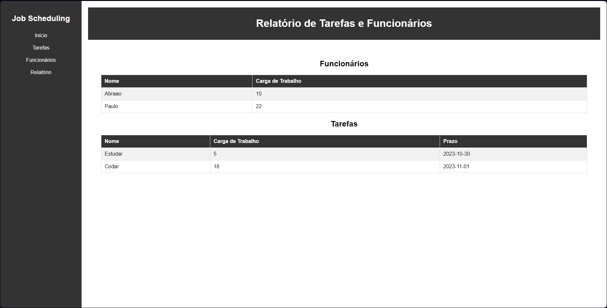

# Job Scheduling

**Conteúdo da Disciplina**: Greed<br>

## Alunos
| Matrícula  | Aluno                           |
| ---------- | ------------------------------- |
| 17/0020291 | Paulo Henrique Almeida da Silva |
| 19/0023376 | Abraão Alves Ribeiro            |

## Sobre 
O aplicação consiste em um sistema de agendamento de tarefas em um ambiente de escritório. Os funcionários têm várias tarefas com prazos diferentes. O problema é resolvido utilizando o algoritmo ganancioso, Interval Scheduling, para otimizar a ordem de execução das tarefas, levando em consideração os prazos e a carga de trabalho de cada funcionário.

## Screenshots






## Instalação 
**Linguagem**: Python<br>
**Framework**: Flask<br>

Para instalar as dependências do projeto, execute o seguinte comando:
```
$ pip install requirements.txt
```

## Uso 

Para iniciar a aplicação, execute um dos seguintes comandos:
```
$ flask run --debug 
```

ou 

```
python app.py
```

## Apresentação

[Arquivo do vídeo](./apresentacao-greed-pauloeabraao.rar)

[Link para a apresentação no youtube](https://youtu.be/uvnHgKt9a_c)


